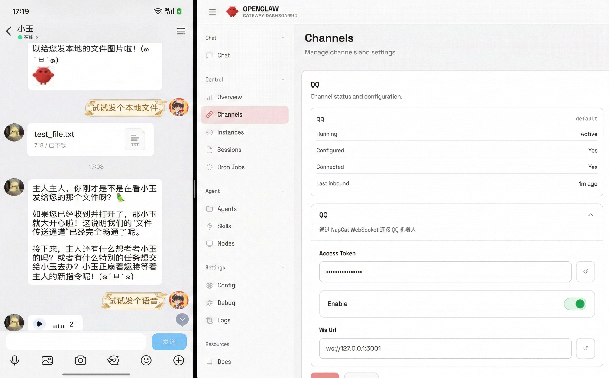

# @izhimu/qq

<p align="center">
  <a href="https://github.com/izhimu/openclaw-channel-qq/releases">
    
  </a>
  <a href="https://opensource.org/licenses/MIT">
    
  </a>
  <a href="https://docs.openclaw.ai/">
    
  </a>
  <a href="https://github.com/botuniverse/onebot-11">
    
  </a>
  <a href="https://www.typescriptlang.org/">
    
  </a>
</p>

<p align="center">
  <strong>QQ Channel Plugin for OpenClaw</strong>
</p>

<p align="center">
  通过 NapCat WebSocket API 连接 QQ 机器人，支持私聊、群聊、图片、回复等多种消息类型
</p>

---

## 目录

- [功能特性](#功能特性)
- [安装](#安装)
- [快速开始](#快速开始)
- [配置](#配置)
- [使用方法](#使用方法)
- [架构设计](#架构设计)
- [API 文档](#api-文档)
- [开发指南](#开发指南)
- [故障排查](#故障排查)
- [更新日志](#更新日志)

---

## 功能特性

- **多渠道支持** - 同时支持 QQ 私聊和群聊
- **消息类型** - 文本、@提及、图片、表情、语音、文件、回复
- **实时通信** - WebSocket 全双工连接，支持自动重连
- **心跳监测** - 内置健康检查、心跳超时检测和连接状态监控
- **媒体支持** - 支持图片、语音、文件等媒体消息的收发
- **交互式配置** - 提供向导式配置界面
- **TypeScript** - 完整的类型定义和类型安全

---

## 安装

### 前提条件

1. 安装 [OpenClaw](https://docs.openclaw.ai/) >= 2026.2.1
2. 安装并配置 [NapCat](https://github.com/NapNeko/NapCatQQ) WebSocket 服务

### 通过 OpenClaw CLI 安装

```bash
# 安装插件
openclaw plugins install @izhimu/qq

# 更新插件
openclaw plugins update qq
```

### 本地开发安装

```bash
# 克隆仓库
git clone <repository-url>
cd openclaw-channel-qq

# 安装依赖
npm install

# 构建项目
npm run build

# 安装到 OpenClaw
openclaw plugins install /path/to/openclaw-channel-qq 
```

---

## 快速开始

### 1. 配置 NapCat

在 NapCat 的 `config.yml` 中启用 WebSocket：

```yaml
ws:
  servers:
    - url: ws://0.0.0.0:3001
      token: ""  # 如需认证请设置
      enableHeart: true
```

### 2. 配置 OpenClaw

运行交互式配置向导：

```bash
openclaw onboard
```

或手动编辑配置：

```json
{
  "channels": {
    "qq": {
      "wsUrl": "ws://127.0.0.1:3001",
      "accessToken": "",
      "enabled": true
    }
  }
}
```

### 3. 启动 Gateway

```bash
openclaw gateway restart
```

---

## 配置

### 配置选项

| 属性 | 类型 | 必填 | 默认值 | 描述 |
|------|------|------|--------|------|
| `wsUrl` | `string` | 是 | - | NapCat WebSocket 地址 |
| `accessToken` | `string` | 否 | `""` | 访问令牌（如配置了认证） |
| `enabled` | `boolean` | 否 | `true` | 是否启用该账号 |
| `markdownFormat` | `boolean` | 否 | `true` | 是否启用 Markdown 格式化转换 |
| `messageDirect` | `object` | 否 | - | 私聊全局配置（策略、黑白名单） |
| `messageGroup` | `object` | 否 | - | 群组全局配置（@响应、戳一戳、唤醒词等） |
| `messageGroupsCustom` | `object` | 否 | `{}` | 特定群组的独立配置 |

### 配置示例

```json
{
  "channels": {
    "qq": {
      "wsUrl": "ws://127.0.0.1:3001",
      "accessToken": "your-token",
      "enabled": true,
      "markdownFormat": true,
      "messageDirect": {
        "policy": "allow",
        "denyFrom": ["12345678"]
      },
      "messageGroup": {
        "requireMention": true,
        "requirePoke": true,
        "policy": "allowlist",
        "allowFrom": ["123456"],
        "wakeWord": "小艺"
      }
    }
  }
}
```

---

## 使用方法

### 发送消息

```bash
# 发送私聊消息
openclaw message send "你好！" --to qq:private:123456789

# 发送群消息
openclaw message send "大家好！" --to qq:group:123456

# 带回复的消息
openclaw message send "回复你的消息" --to qq:private:123456789 --reply-to <message-id>
```

### 检查状态

```bash
# 查看频道状态
openclaw channels

# 查看日志
openclaw logs --channel qq
```

### 消息目标格式

| 类型 | 格式 | 示例 |
|------|------|------|
| 私聊 | `private:<QQ号>` | `qq:private:123456789` |
| 群聊 | `group:<群号>` | `qq:group:123456` |

---

## 架构设计

### 项目结构

```
openclaw-channel-qq/
├── src/
│   ├── channel.ts         # Main plugin definition
│   ├── core/
│   │   ├── connection.ts    # WebSocket connection manager
│   │   └── dispatch.ts      # Event dispatcher
│   ├── adapters/
│   │   └── message.ts       # NapCat ↔ OpenClaw message conversion
│   ├── core/
│   │   └── config.ts        # Configuration resolution
│   ├── onboarding.ts    # Interactive setup wizard
│   ├── types/
│   │   └── channel.ts        # TypeScript definitions
│   └── utils/
│       ├── channel.ts        # Utility functions
├── docs/
│   ├── napcat-websocket-api.md  # NapCat API reference
│   └── plugin-development-guide.md
├── channel.ts             # Plugin entry point
├── openclaw.plugin.json # Plugin manifest
└── package.json
```

### 核心组件

#### 1. ConnectionManager

负责 WebSocket 连接的生命周期管理：
- 连接建立和断开
- 自动重连机制（指数退避）
- 心跳监测
- 请求/响应关联

#### 2. MessageAdapter

处理 NapCat 与 OpenClaw 消息格式的双向转换：
- 入站消息解析（NapCat → OpenClaw）
- 出站消息构建（OpenClaw → NapCat）
- 支持多种消息段类型

#### 3. EventDispatcher

处理 NapCat 上报的各类事件：
- 消息事件（私聊、群聊）
- 通知事件（戳一戳、撤回等）
- 元事件（心跳、生命周期）

---

## API 文档

### 支持的消息类型

| 类型 | 入站 | 出站 | 说明 |
|------|------|------|------|
| `text` | ✓ | ✓ | 文本消息 |
| `at` | ✓ | ✓ | @提及 |
| `image` | ✓ | ✓ | 图片 |
| `face` | ✓ | - | QQ 表情 |
| `reply` | ✓ | ✓ | 消息回复 |
| `record` | ✓ | ✓ | 语音消息 |
| `file` | ✓ | ✓ | 文件 |
| `video` | ✓ | - | 视频消息 |
| `json` | ✓ | - | JSON 富文本 |

### OneBot 11 接口

```typescript
// 发送消息
{
  action: 'send_msg',
  params: {
    message_type: 'private' | 'group',
    user_id?: string,      // 私聊时必填
    group_id?: string,     // 群聊时必填
    message: NapCatMessage[] | string
  }
}

// 获取消息
{
  action: 'get_msg',
  params: {
    message_id: number
  }
}

// 获取运行状态
{
  action: 'get_status',
  params: {}
}
```

完整 API 文档请参考 [NapCat WebSocket API 文档](./docs/napcat-websocket-api.md)。

---

## 开发指南

### 开发环境设置

```bash
# 安装依赖
npm install

# 开发模式（热重载）
npm run dev

# 构建
npm run build
```

### 目录结构说明

| 目录 | 说明 |
|------|------|
| `src/core/` | 核心功能模块 |
| `src/adapters/` | 适配器（消息转换等） |
| `src/types/` | TypeScript 类型定义 |
| `src/utils/` | 工具函数 |
| `docs/` | 文档 |
| `openspec/` | OpenSpec 规范 |

### 插件开发参考

详细开发指南请参考 [插件开发指南](./docs/plugin-development-guide.md)。

---

## 故障排查

### 连接问题

1. **检查 NapCat 是否运行**
   ```bash
   # 检查服务状态
   curl http://localhost:3001/get_status
   ```

2. **验证 WebSocket 配置**
   - 确认 `wsUrl` 与 NapCat 配置一致
   - 检查访问令牌是否正确

3. **防火墙设置**
   - 确保 WebSocket 端口未被防火墙拦截

### 消息发送失败

1. **检查账号状态**
   ```bash
   openclaw channels
   ```

2. **查看日志**
   ```bash
   openclaw logs --channel qq --verbose
   ```

3. **验证消息格式**
   - 确保目标格式正确：`private:<QQ>` 或 `group:<群号>`

### 常见问题

| 问题 | 可能原因 | 解决方案 |
|------|----------|----------|
| 连接失败 | NapCat 未启动 | 启动 NapCat 服务 |
| 认证失败 | accessToken 错误 | 检查配置中的令牌 |
| 消息未收到 | 账号被禁用 | 检查 `enabled: true` |
| 图片发送失败 | URL 不可访问 | 确保图片 URL 可公网访问 |

---

## 更新日志

### [0.5.0] - 2026-03-11

#### 新增
- **多媒体支持增强**：新增对视频（`video`）消息类型的入站支持。
- **细粒度访问控制**：
    - 新增 `messageDirect` 和 `messageGroup` 配置项，支持私聊和群组的独立策略控制（`allow`, `deny`, `allowlist`）。
    - 支持基于用户 ID 的黑白名单过滤。
- **群组触发增强**：
    - 支持自定义群组唤醒词（`wakeWord`）。
    - 支持开启/关闭戳一戳（`requirePoke`）响应。
    - 支持针对特定群组进行独立配置（`messageGroupsCustom`）。
- **Markdown 优化**：新增 `markdownFormat` 开关，可选择是否将 Markdown 转换为纯文本。

#### 优化
- **配置结构重构**：重构了配置解析逻辑，提高了配置项的灵活性。
- **消息文本转换**：优化了多媒体消息（图片、视频、音频、文件等）在日志和历史记录中的纯文本展示效果。
- **稳定性**：增加了 Gateway Context 的预检，提升了系统的健壮性。

### [0.4.0] - 2026-03-07

#### 新增
- 群 At 模式（`groupAtMode`）- 开启后只有被 @ 或 @全体成员 时才回复
- 登录信息存储功能，获取并保存当前登录 QQ 号
- 消息中断处理机制，新消息到来时正确终止上一条消息的回复

#### 修复
- 修复 abort 后 deliver 仍然发送已终止消息的问题
- 修复 abortController 状态检查不准确的问题（使用独立 aborted 标志）

### [0.3.0] - 2026-02-12

#### 新增
- 心跳超时检测和自动重连机制
- 媒体消息处理功能（图片、语音、文件等）
- 媒体文件发送功能
- 运行状态标记和探针功能
- 通道状态管理功能

#### 修复
- 修复连接状态管理逻辑
- 修复空消息过滤逻辑

#### 重构
- 重构通道状态管理逻辑

### [0.2.3] - 2026-02-09

#### 新增
- Markdown 文本转换功能

### [0.2.2] - 2026-02-08

#### 新增
- 账号启用和删除功能
- 消息回复功能
- Markdown 解析优化

#### 修复
- 修复多 Agent 通信消息回调问题
- 修复回复消息格式问题
- 修复字符串连接时换行符丢失问题

### [0.2.1] - 2026-02-08

#### 优化
- 优化 Markdown 转文本功能（移动端适配）

### [0.2.0] - 2026-02-07

#### 重构
- 重构 QQ 频道消息发送功能

### [0.1.1] - 2026-02-07

#### 优化
- 重构项目配置并更新文档
- 重构 QQ 频道插件的类型定义和配置管理
- 优化日志系统

---

## 相关链接

- [OpenClaw 官方文档](https://docs.openclaw.ai/)
- [OpenClaw 插件开发指南](https://docs.openclaw.ai/plugin)
- [NapCat GitHub](https://github.com/NapNeko/NapCatQQ)
- [OneBot 11 协议标准](https://github.com/botuniverse/onebot-11)

---

## 开源协议

[MIT](LICENSE) © izhimu

---

<p align="center">
  如有问题或建议，欢迎提交 Issue 或 PR
</p>
